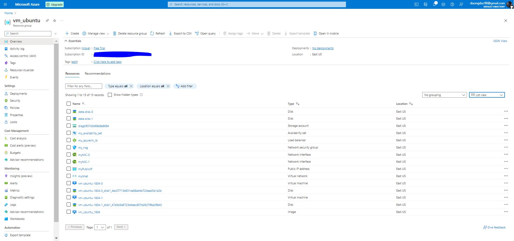

# Azure Infrastructure Operations Project: Deploying a scalable IaaS web server in Azure

### Introduction
For this project, you will write a Packer template and a Terraform template to deploy a customizable, scalable web server in Azure.

### Getting Started
1. Clone this repository

2. Create your infrastructure as code

3. Update this README to reflect how someone would use your code.

### Dependencies
1. Create an [Azure Account](https://portal.azure.com) 
2. Install the [Azure command line interface](https://docs.microsoft.com/en-us/cli/azure/install-azure-cli?view=azure-cli-latest)
3. Install [Packer](https://www.packer.io/downloads)
4. Install [Terraform](https://www.terraform.io/downloads.html)

### Instructions
1. Policy
- az login in azure cli
- cd policy
- Create "tagging-policy" definition by using script in create-definition.sh
- Assign "tagging-policy" by using script in assign-policy.sh
2. Packer
- az login in azure cli
- Create resource group: "az group create -n vm_ubuntu -l eastus"
- Create Azure credentials: "az ad sp create-for-rbac --role Contributor --scopes /subscriptions/<subscription_id> --query "{ client_id: appId, client_secret: password, tenant_id: tenant }"" and save the out put to .env file
- cd packer
- Create new file ubuntu.json to define packer template
- Open Powershell window in packer folder
- Run the script: "packer build ubuntu.json"
3. Terraform
- Files in folder terraform:
+ providers.tf : define required providers
+ main.tf: define the resource to be created
+ variables.tf: define varibles to be used in main.tf
+ outputs.tf: how the output will be shown
- Run "terraform init" to initialize needed providers
- Run "terraform plan -out solution.plan" to create the plan
- Run "terraform destroy" once done
### Output
1. Policy

  

2. Packer

  

  

3. Terraform

  

  

